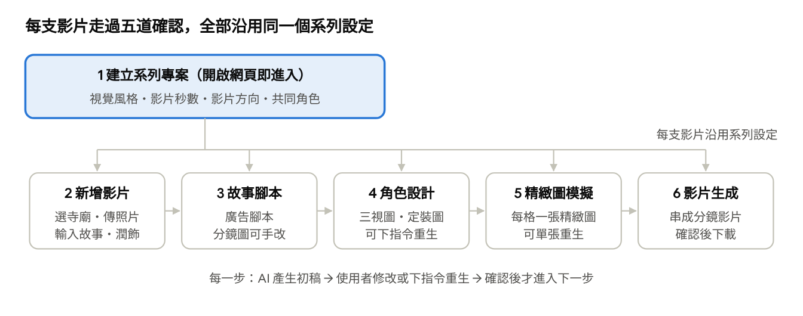

# 廟埕影室（Templeyard Studio）系統規格書

Oct 3, 2026 · @Bonki

## 系統定位

廟埕影室（Templeyard Studio）是寺廟觀光短影音的自動化輔助系統：使用者建立系列專案，每支影片選一間新北市寺廟、上傳 1～5 張照片與一段故事，AI 依序產生文案、廣告腳本與分鏡、角色、精緻圖與分鏡影片，每一步都由使用者修改並確認後才往下。

系統要解決的是「有 AI，不等於有流程」：現有 AI 工具各自解決一部分，每支影片都要從頭拼接，系列風格也難以一致。本系統把素材、故事到影音串成一條可確認、可重複的流程，目標是讓地方故事持續被看見（AI 賦能觀光影音 × 地方文化內容再造）。

## 目標使用者與使用情境

**目前是個人使用的專案**：使用者就是開發者本人，在本機執行，不對外開放。以下描述的是之後若對外提供時的目標使用者。

使用者是推廣新北市寺廟與地方文化的人：觀光業者、地方文化推廣者與廟方，他們有照片與在地故事，但不具編劇、分鏡與影片製作能力。系列專案讓同一位使用者能以一致的角色與風格，連續介紹多間寺廟。

典型情境：使用者拍了一間廟的幾張照片，知道一個只在地方流傳的故事，想把它做成觀光短影音，並且接著用同樣的風格做下一間廟。

| 核心價值 | 系統怎麼做 |
| --- | --- |
| 系列一致 | 風格、秒數、影片方向與共同角色設在系列專案，每支影片沿用 |
| 階段協作 | 流程切成 6 步，每步由 AI 產生初稿、使用者修改 |
| 降低門檻 | 使用者只提供照片與故事；寺廟基本資料由資料庫帶入 |
| 人工確認 | 每一步都要使用者確認才送到下一關，不自動發布 |

## 使用者流程

流程共 6 步：第 1 步每個系列只做一次，第 2～6 步每支影片各走一次，每步確認後才送到下一關。

寺廟在第 2 步才選，所以同一個系列可以用一致的角色與風格介紹多間廟。

## 影片規格與品質標準

成品為 30 秒以內的寫實電影感短片，品質以「開頭與結尾.mp4」為參考：同一位角色在多個鏡頭中外觀一致、對鏡頭說中文、畫面搭配繁中字幕與背景音樂。圖片與影片由 Higgsfield 生成，不使用 ComfyUI。

| 項目 | 規格 |
| --- | --- |
| 長度 | 30 秒以內，由系列設定決定 |
| 比例與解析度 | 16:9、1920×1080、24 fps（參考影片為 1280×720、24 fps） |
| 鏡頭數與節奏 | 8～12 格，每格約 2～4 秒 |
| 景別 | 遠景（廟宇全景）、中景（角色與場景）、特寫（臉部、手部、照片與物件）交錯使用 |
| 畫面 | 寫實、自然光、淺景深；廟宇建築依使用者照片呈現 |
| 角色 | 同一角色的臉、髮型、服裝跨鏡頭一致 |
| 聲音 | 角色對鏡說中文並對上口型，或以旁白呈現；全片背景音樂 |
| 字幕 | 繁體中文，燒錄於畫面下方置中，白字 |
| 文字特效 | 選用：少量浮動關鍵字（例如「故事」「腳本」「畫面」） |

**品質檢查**：每格影片確認前檢查角色是否變臉、口型是否對上、手部與文字是否變形、廟宇建築是否與照片一致；任一項不合格就重生該格。

## 功能規格

每一步都依同一個模式運作：AI 依前一步的結果與系列設定產生初稿，使用者手動修改或輸入指令要求重生，確認後才送到下一關。回到前面的步驟修改時，後續步驟已確認的內容會標示為「需重新確認」。

### 1. 建立系列專案

使用者打開網頁就進入建立系列專案的首頁，不需要登入；首頁同時列出已建立的系列，點選即可繼續製作。

- **輸入**：系列名稱、整體視覺風格、影片秒數、影片方向（例如歷史故事、節慶宣傳、景點導覽）、共同角色。
- **用途**：這些設定是此系列每支影片的共同依據，後續步驟的 AI 產生都必須引用。
- **共同角色**：可在此先建立，或在第一支影片的角色設計步驟產生後設為系列角色。
- **修改**：系列設定可隨時修改，只影響之後新增的影片，已完成的影片不變。

### 2. 新增影片

- **選擇寺廟**：以廟名、行政區或主祀神明搜尋寺廟資料庫，選定後帶入廟名、地址、主祀神明、教別與創建年；另有一個選填欄位讓使用者自己貼上寺廟的歷史與簡介，AI 可引用。
- **上傳照片**：1～5 張要介紹的照片；上傳後自動去識別（見非功能需求），使用者看到處理後的照片。
- **輸入故事**：影片要表達的故事或情節說明。
- **AI 潤飾**：按鈕依系列規範修飾文案，使用者可接受、再修改或保留原文。潤飾只能使用寺廟資料與使用者輸入的內容，不自行添加歷史事實。
- **確認條件**：已選寺廟、至少 1 張照片完成去識別、故事不為空。

### 3. 故事腳本

- **AI 產生**：以廣告編劇的角度，依故事、寺廟資料與系列設定（秒數、方向）產生廣告腳本，並拆成分鏡；每格包含分鏡圖與分鏡說明；說明欄位包括場景、對應照片、景別、構圖、運鏡、轉場、鏡頭意圖、敘事角色、角色動作、台詞或旁白（含說話角色）與字幕。
- **手動修正**：分鏡圖與每格說明都可修改，也可以單格重生。
- **確認條件**：每格都有說明，分鏡總長度符合系列秒數。

### 4. 角色設計

- **AI 產生**：依分鏡腳本中需要的角色，產生三視圖與定裝圖；系列已有的共同角色直接沿用，不重新產生。
- **重新生成**：使用者可輸入指定要求讓 AI 重生。
- **版本**：確認後的角色鎖定為一個版本，後續精緻圖與影片都使用此版本；可加入系列角色供之後的影片使用。

### 5. 精緻圖模擬

- **AI 產生**：依分鏡圖、角色與使用者上傳的照片，為每格產生一張精緻圖；生成過程以分鏡膠捲即時顯示每格進度，完成一格就填上一格。
- **重新生成**：可單張重生，或輸入調整指令後重生。
- **確認條件**：每格都有一張被選定的精緻圖。

### 6. 影片生成

- **AI 產生**：將每張精緻圖依分鏡腳本的內容生成分鏡影片，再串聯成一支完整影片。每格以第 5 步確認的精緻圖作為影片首格（需要時也作為末格），讓模型只補動作，不改變角色與廟宇外觀。
- **重新生成**：可要求重生，或輸入調整指令後重生；重生以單一分鏡為單位。
- **確認與下載**：合成時加入角色台詞（模型原生語音並對口型，或語音合成）、背景音樂與燒錄字幕，剪成 30 秒以內的成品；使用者確認成品後可下載。

## Prompt 指令管理

每個 AI 生成節點都有自己專屬的 prompt 指令，一個指令是一個 JSON 檔；管理頁儲存後直接更新檔案，系統生成時由 API 依檔案與輸入資料組出送給 AI 的內容。

| 步驟 | 節點 | 檔案 | 生成類型 |
| --- | --- | --- | --- |
| 2 | 故事文案潤飾 | `copy-polish.json` | 文字 |
| 3 | 故事與分鏡腳本 | `story-script.json` | 文字（輸出 JSON） |
| 3 | 分鏡圖 | `storyboard-image.json` | 圖片 |
| 4 | 角色三視圖與定裝圖 | `character-sheet.json` | 圖片 |
| 5 | 精緻圖 | `refined-frame.json` | 圖片 |
| 6 | 分鏡影片 | `shot-video.json` | 影片 |

- **檔案內容**：名稱、步驟、生成類型與模型、system 指令、指令內容（以 `{{temple.name}}` 這類標記插入資料）、變數清單（是否必填、測試範例）、輸出格式；可依指定模型放入該模型專用的寫法規則（例如 Seedance、Kling 各一套），換模型時不必重寫整份指令。
- **儲存規則**：指令用到未宣告的變數時拒絕儲存；每次儲存版本加一，舊版保留在歷史資料夾；兩人同時修改時，後儲存的人會收到衝突提示，不會覆蓋對方。
- **組裝**：系統呼叫 `POST /api/prompts/:id/render` 並傳入變數，取得已帶入資料的 system 與指令內容；必填變數缺少時拒絕。同一份指令也會轉成等價的 JavaScript 函式供檢視。
- **可追溯**：每筆生成紀錄記下使用的 prompt id 與版本。
- **權限**：管理頁不放在使用者介面中，只在開發與營運環境使用。

**管理工具 Prompt Studio**：已實作的管理頁與 API，位於專案資料夾的 `prompt-studio/`，需 Node.js 18 以上，不需安裝套件。

- **啟動**：在 `prompt-studio/` 執行 `node server.js`，開啟 http://localhost:3300；`npm test` 執行 8 項 API 測試。
- **編輯頁**：左側依步驟列出各節點；中間編輯名稱、生成類型、模型、畫面比例、system 指令、指令內容、變數與輸出格式，按「儲存」或 ⌘S 寫回 JSON 檔；右側填入測試變數後預覽送給 AI 的內容與等價的 JavaScript。
- **版本**：舊版保存於 `prompts/.history/<id>/v<版本>.json`，可從「歷史版本」選單載回編輯器。
- **API**：列出、讀取、儲存（版本不符回 409、驗證失敗回 422）、歷史版本與組裝，完整列表見 `prompt-studio/README.md`。
- **尚未包含**：實際呼叫 AI 模型（只組出內容）；各圖片與影片節點的模型欄位尚未填入 Higgsfield 模型名稱，畫面比例仍為 9:16，需改為 16:9。

所有指令的 system 部分都寫入「內容與宗教」規則：只使用寺廟資料與使用者輸入、不對神明不敬、不出現可辨識的真實民眾。

## 寺廟資料庫

寺廟資料庫來自「新北市寺廟資料.csv」，共 982 筆、清理後 940 間有效寺廟，用在步驟 2 的寺廟搜尋，並作為 AI 潤飾與腳本唯一可引用的寺廟事實。資料庫只讀不寫，使用者的補充內容存在影片的故事裡。

| 欄位 | 內容 | 清理規則 |
| --- | --- | --- |
| 編號 | 原始 UUID | 直接作為主鍵 |
| 廟名 | 登記名稱 | 保留原文；另標記財團法人、已廢止、未取得登記證與重名 |
| 地址、行政區、里 | 全部位於新北市 | 里別缺漏時從地址嘗試補上 |
| 電話 | 登記電話 | 正規化為含區碼的數字，保留原始值 |
| 主祀神明、教別 | 例如福德正神、道教 | 保留原文 |
| 創建年、重建年 | 民國、民前、清代年號、日據紀年 | 換算西元年，無法判斷者留空；保留原始紀年 |
| 祭典日期 | 全部空白 | 移除 |

**搜尋**：預設排除 41 間已廢止與 1 間未登記的寺廟；廟名需支援模糊比對（「臺」「台」混用、「財團法人新北市」前綴），重名時以行政區區分。

**已知限制**：資料沒有座標、簡介與歷史（歷史與簡介由使用者在步驟 2 自行貼上）；未登記的寺廟不在資料中；萬壽宮、慈德廟的創建年換算為 1562、1558 年，待查證。

## 資料模型

系統有多個系列專案（MVP 不區分使用者），一個系列有多支影片，每支影片關聯一間寺廟；每一步的產出都保留版本，以便重生後比較與回溯。

| 資料 | 主要內容 | 關聯 |
| --- | --- | --- |
| 系列專案 | 名稱、視覺風格、影片秒數、影片方向 | 含多支影片、多個系列角色 |
| 寺廟 | 見「寺廟資料庫」 | 可被多支影片引用 |
| 影片 | 目前步驟、各步確認狀態 | 屬於一個系列、關聯一間寺廟 |
| 照片 | 原圖（私有）、去識別後的圖、處理紀錄 | 屬於一支影片，1～5 張 |
| 故事 | 使用者原文、AI 潤飾版、採用版 | 屬於一支影片 |
| 腳本與分鏡 | 廣告腳本；每格的分鏡圖、說明、秒數 | 屬於一支影片，依順序排列 |
| 角色與角色版本 | 名稱、三視圖、定裝圖、是否為系列角色 | 系列角色屬於系列，其他屬於影片 |
| 精緻圖 | 每格的候選圖與選定圖 | 屬於一個分鏡 |
| 分鏡影片與成品 | 每格的影片片段、串聯後的成品 | 片段屬於分鏡，成品屬於影片 |
| 生成紀錄 | 輸入、使用者指令、使用的模型、狀態、成本 | 每次 AI 產生一筆 |
| 確認紀錄 | 步驟、確認的內容版本、時間 | 每次確認一筆 |

## 非功能需求

最重要的三項是：照片去識別後才能送出、任何付費生成前先讓使用者知道費用、不捏造寺廟歷史。

| 類別 | 需求 | 做法 |
| --- | --- | --- |
| 去識別 | 照片中的信眾、香客、路人臉孔與車牌，在送往外部 AI 服務與輸出前先遮蔽 | 上傳後自動偵測遮蔽並顯示結果；神像臉部不得被遮蔽；原圖保持私有 |
| 成本控制 | 使用者在付費生成前知道費用，不超過上限 | 每筆付費生成依「預估 → 預留 → 結算」記帳，失敗時退回預留金額；生成前顯示預估費用；每支影片有費用上限，單筆超過門檻或累計超過上限時需再次同意 |
| 系列一致 | 同系列影片的風格與角色外觀一致 | 系列設定與角色版本鎖定，每次生成都帶入 |
| 人工確認 | 未確認的內容不進入下一步 | 確認記錄內容版本；前面步驟被修改時，後續確認失效；被取代的版本與確認紀錄保存在歷史中，不刪除 |
| 內容與宗教 | 不捏造寺廟歷史，不產生對神明不敬的畫面 | AI 只引用寺廟資料與使用者輸入；提示詞禁止不敬的動作與場景 |
| 可追溯 | 每支成品能追到輸入與費用 | 生成紀錄保存輸入、指令、模型、成本；各步產出保留版本 |
| 存取控管 | MVP 不做登入，任何開啟網頁的人都能看到並修改所有系列 | 目前只在本機個人使用，不公開部署；照片與成品以短期網址存取；付費生成仍受費用上限控管 |

## 參考設計：OpenMontage

本系統參考開源專案 [OpenMontage](https://github.com/calesthio/OpenMontage) 的 6 項設計想法，但不引用其程式碼與提示詞文字：該專案採 AGPLv3 授權，若將其程式碼納入本系統的網頁服務，整個服務的原始碼須以同授權公開。

| 設計 | 本系統的做法 | 見哪一節 |
| --- | --- | --- |
| 分鏡欄位 | 每格分鏡記錄構圖、運鏡、轉場、鏡頭意圖、敘事角色、角色動作與對應照片 | 功能規格 3 |
| 依模型區分的提示詞規則 | 每個 prompt 檔可放入指定模型專用的寫法 | Prompt 指令管理 |
| 鎖住首尾畫格 | 精緻圖作為分鏡影片的首格，維持角色與廟宇外觀 | 功能規格 6 |
| 三段式成本控管 | 預估 → 預留 → 結算，單筆超過門檻需同意 | 非功能需求：成本控制 |
| 保留歷史版本 | 被取代的產出與確認紀錄不刪除 | 非功能需求：人工確認 |
| 即時進度看板 | 生成時以分鏡膠捲逐格顯示進度 | 功能規格 5 |

未採用的部分：OpenMontage 由 AI 編碼助理臨場決定流程，適合技術使用者；本系統的使用者不具技術背景，流程由網頁固定為 6 步，只接少數生成供應商。

## 範圍與待決事項

MVP 涵蓋完整 6 步流程、寺廟資料庫與照片去識別；登入、發布到社群平台與新北市以外的寺廟留待後續。

| 範圍 | 內容 |
| --- | --- |
| MVP 範圍內 | Web 版（開啟即進入建立專案首頁）、系列專案設定、寺廟搜尋、照片上傳與去識別、AI 潤飾、腳本與分鏡、角色設計、精緻圖、分鏡影片、台詞語音與背景音樂、繁中字幕與下載、費用預估與上限 |
| MVP 範圍外 | 自動發布到社群平台、新北市以外的寺廟、多語字幕、原生 App、登入與帳號權限、多人共同編輯同一系列 |

**待決事項**

- [x] 目標使用者以誰為主：觀光業者、地方文化推廣者，還是廟方？→ 目前為個人使用，使用者是自己；對外的目標使用者之後再定。
- [x] 影片秒數提供哪些選項，輸出的比例、解析度與是否含字幕、片頭片尾？→ 30 秒以內，品質以參考影片為準，見「影片規格與品質標準」。
- [x] 神明可不可以成為角色？若可以，形象由誰核准？→ 個人使用時由自己決定並核准。
- [x] 費用由誰負擔：免費額度、點數還是訂閱？→ 自行負擔，以每支影片的費用上限控管，不做計費功能。
- [x] 各步使用哪些生成模型與供應商（文字、圖片、影片）？→ 圖片與影片生成使用 Higgsfield，不使用 ComfyUI。影片模型必須支援多張參考圖的角色一致與中文對口型，先以 Higgsfield 上的 Seedance 2.0 實測；文字生成（潤飾、腳本）的模型另定。
- [x] 寺廟資料沒有歷史與簡介，是否另求可靠來源補充？→ 由使用者自己貼上，系統不另接資料來源。
- [x] 比賽展示用哪間寺廟作為示範系列？→ 目前不需要。
